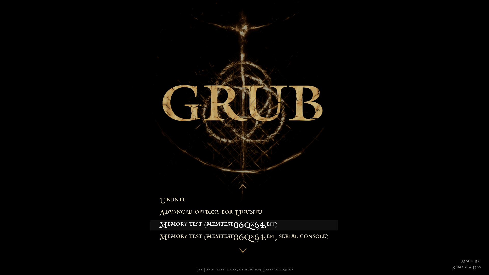

# ELDEN RING GRUB2 THEME
An Elden Ring based GRUB2 (**GR**and **U**nified **B**ootloader) theme mostly for those who have dual booted their system(like me) but not excepting those who use GRUB without it. 

Made it in free time just for my own amusement so might not look good.
## INSTALLATION

1) Download the source code of this repo and add it to your `/boot/grub/themes`. (Create the directory if it isn't present.) 
2) Add the path to `GRUB_THEME` in the file `/etc/default/grub`
3) Finalize your changes with `sudo update-grub`
4) Your theme is ready. Now enjoy!

## TO-DO
- Make the selected item overlay better
- Make the text centered if possible
- Make the terminal look like the settings tab of Elden Ring

## Screenshot

